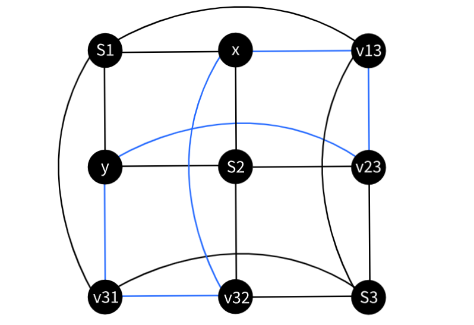
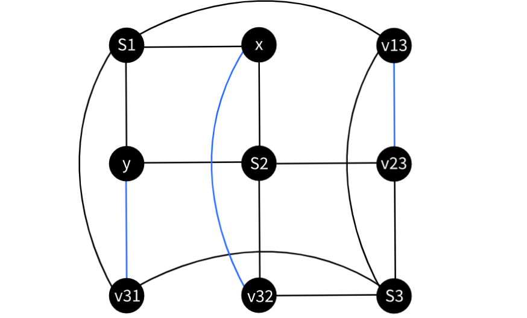
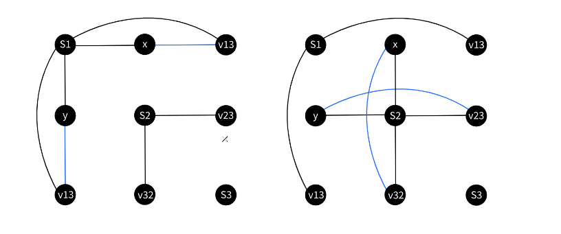
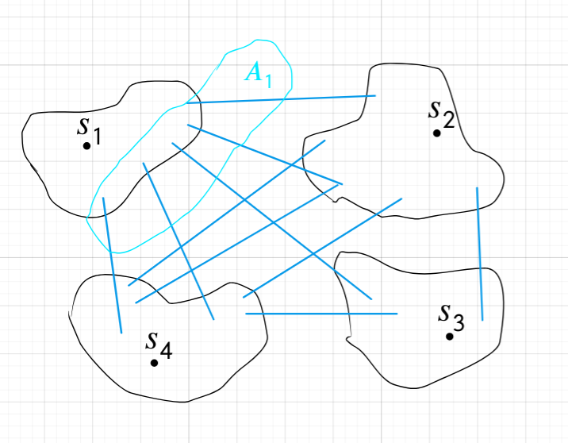

# Задача о наименьшем мультиразрезе (MULTIWAY k-CUT Problem)
## Постановка задачи
Пусть задан взвешенный неориентированный граф $(G = (V, E), w: E → \mathbb{R}_+)$, в
котором отмечены вершины $s_1, \dots , s_k$ (далее будем обозначать их терминалами или терминальными). Требуется найти наименьший мультиразрез
(minimum multicut), т. е. множество рёбер $E'$ наименьшего суммарного веса, такое
что отмеченные вершины находятся в разных компонентах $(V, E \setminus	 E' )$

Заметим, что при $k = 2$, задача решается за полиномиальное время алгоритмами поиска максимального потока.

## NP-трудность

Считаем, что нам известна NP-полнота задачи **MAX CUT**. Дан граф $G =(V, E)$, требуется найти 
$V_1, V_2 |\ V_1 \sqcup V_2= V$, такие, что количество ребер между $V_1, V_2$ максимально.

Полиномиально сведем задачу **MAX CUT** к задаче  **MULTIWAY 3-CUT**.

Рассмотрим вспомогательный гаджет $C$.

Вершины $s_1, s_2, s_3$ являются терминальными. Ребра черного цвета имеют вес 4, ребра синего цвета имеют вес 1.

Обозначим за $c^*$ - вес оптимального разреза, $c(i, j)$ - вес отимального разреза, в котором $x$ соединен с $s_i$, 
а  $y$ с $s_j$.
 
**Лемма 1.**  

1) $c^* = c(1, 2) = c(2, 1) = 27$

2) $\forall \{i, j\}  \ne \{1, 2\} \ \ c(i, j) \ge c^* + 1$

3) $c(1, 1) = c(2, 2) = 28$

**Доказательство**

1) Докажем что $c^* = 27$. 

Предположим, что существует разрез веса 26 или меньше. Рассмотрим вершины кроме терминальных, каждая из них соединена 
с двумя различными терминальными ребрами веса 4, значит любой разрез содержит 6 ребер веса 4, 
каждое из этих ребер соединено со своей нетерминальной вершиной. 
Так как вес разреза 26 или меньше остальные ребра в нем имеют вес 1 
Теперь рассмотрм ребра веса 1, они образуют цикл на нетерминальных вершинах. Цикл устроен таким образом, 
что не существует терминала, который соединен с какими то 3мя подряд идущими вершинами.
Если мы уберем из этого цикла не более 2х ребер, то он распадется на не более чем две компонеты, 
в одной из которых хотя бы 3 вершины. 
Рассмотрим компоненту цикла, содержащую три подряд идущие вершины. 
Каждая из этих трех вершин соединена с каким то терминалом, причем это не может быть один и тот же терминал. 
Значит это какие то два различных терминала, а значит при таком разрезе какие то два терминала все же соединены. 
Пришли к противоречию.

С другой стороны, если убрать все ребра между колонками или рядами, то вес такого разреза будет 27. 
Причем разрез, убирающий ребра между рядами (горизонтальный), оставляет $x$ соединенным с $s_1$, $y$ с $s_2$, 
а разрез, убирающий ребра между колонками (вертикальный), оставляет $x$ соединенным с $s_2$, $y$ с $s_1$.

2) Предположим что существует разрез, отличающийся от горизотального или вертикального, веса 27. 
Из доказательства пункта 1 мы знаем, что он состоит из 6 ребер веса 4, и 3х ребер веса 1. 
Рассмотрим пересечение этого разреза с циклом из единичных ребер. 
Заметим, что есть всего два способа выбрать из шести ребер три, так чтобы в цикле не осталось три подряд идущие вершины:
удалить ребра $(y, v_{31}), (x, v_{32}), (v_{13}, v_{23})$ или $(y, v_{23}), (x, v_{13}), (v_{31}, v_{32})$.
Как мы выяснили в предыдущем пункте, если удалим только 6 ребер веса 4 и оставим в цикле 3 подряд идущие в цикле вершины, 
то какие то два терминала окажутся соединены. 
Докажем, что если мы удалили 6 единичных ребер и 3 ребра из цикла одним из двух рассотренных выше способов, 
то такой разрез обязательно будет вертикальным или горизонтальным. 

Рассмотрим случай, если мы удалили $(y, v_{23}), (x, v_{13}), (v_{31}, v_{32})$, другой случай рассматривается аналогично.

Рассмотрим вершину $v_{23}$, мы обязаны удалить ребро $(s_2,  v_{23})$, так как, если мы удалим ребро $(s_3,  v{23})$, 
$s_2$ и  $s_3$ остануться связаны. 
Далее рассмотрим вершину $v_{13}$, мы обязаны удалить ребро $(s_1,  v_{13})$, $s_1$ и  $s_3$ остануться связаны.
Далее рассмотрим вершину $v_{32}$, мы обязаны удалить ребро $(s_3,  v_{32})$, иначе, какое ребро мы бы не удалили у $x$ 
$s_3$ останентся связаной с $s_1$ или $s_2$.
Далее рассмотрим вершину $x$, мы обязаны удалить ребро $(s_1, x)$, иначе $s_1$ останентся связаной с $s_2$.
Далее рассмотрим вершину $v_{31}$, мы обязаны удалить ребро $(s_3,  v_{31})$, $s_1$ и  $s_3$ остануться связаны.
Осталось удалить ребро $(y, s2)$ и мы получили вертикальный разрез.

Итого мы доказали, что существует всего два разреза стоимости 27 это горизонтальный и вертикальный. Отсюда следует пункт 2.

3) Примеры разрезов веса 28.

$\square$

Теперь опишем сведение. Построим граф $G(V, E)$ по графу $H(V^*, E^*)$, взяв все вершины графа H. 
Добавим в G вершины $t_1$, $t_2$, $t_3$. Вместо каждого ребра $(u, v)$ графа H, 
добавим гаджет C где, на месте вершин $x$, $y$ будут $u$, $v$, на месте терминалов $s_1, s_2, s_3$, 
терминалы $t_1$, $t_2$, $t_3$. Итого получили граф $G(V, E)$, где $|V| = |V^*| + 4 |E^*| +  3$,
 $|E| = 18 |E^*|$.

Введем обозначения:

* ***разрез*** - множетсво ребер графа H, концы которых лежат в разных подмножетсвах $V_1, V_2 |\ V_1 \sqcup V_2 = V^*$

Вес разреза - количество ребер в нем.

* ***3-разрез*** - множетсво ребер $E' \subset E$ такое, что не существует пути между 
$t_1, t_2, t_3$ в графе $G(V, E \setminus E')$

Вес 3-разреза - сумма весов ребер в нем.

Задача MAX CUT состоит в максимизации веса разреза, задача MULTIWAY 3-CUT в минимизации веса 3-разреза.

**Лемма 2.**  

В графе H есть разрез веса $K$ или больше $\Leftrightarrow$ В графе G есть 3-разрез веса $28 |E^*| - K$ или меньше.

**Доказательство**

$\Rightarrow$ Предположим существует разрез веса $K' \ge K$, которому соответствует разбиение $V_1, V_2 |\ V_1 \sqcup V_2 = V^*$,
 тогда проведем разрез в каждом гаджете с условиями, что вершины, пробразы которых лежат в V_1, останутся соединены с s_1, 
, а вершины, пробразы которых лежат в V_2, останутся соединены с s_2, .
По лемме 1, если в каком то гаджете мы наложили условия что x, y должны остаться соединенными с одним и тем же терминалом, 
то вес разреза в таком гаджете будет 28, если же x, y должны остаться соединенными с разными терминалом, то вес будет 27.
Итого получим 3-разрез веса $28 (|E^*| - K') + 27 K' = 28 |E^*| - K' \le  28 |E^*| - K$, то что и хотели.

$\Leftarrow$ Предположим сущетствует 3-разрез веса $L' \le  28 |E^*| - K$, обозначим за $U_1, U_2, U_3$, 
множетсва вершин, которые остались соединены с $t_1, t_2, t_3$, после удаления ребер 3-разреза.
Построим разбиение графа H, к V_1 отнесем вершины образы которых лежат в $U_1$, 
к $V_2$ отнесем вершины образы которых лежат в $U_2$ или $U_3$. Посмотрим на то, как 3-разрез разрезал наши гаджеты. 
Так как его вес менее $28 |E^*| - K$, то существует хотя бы K гаджетов, таких, что $v \in U_1, u \in U_2$, или наоборот.
Иначе вес 3-разреза был бы  больше по Лемме 1.
А значит в разрез в графе H попадет хотя бы K ребер.

$\square$

Из данной леммы следует, что если мы найдем 3-разрез минимального веса в графе G, 
то сможем по нему восстаносить разрез максимального веса в графе H. То есть сведение доказано.

## Приближенный алгоритм

Вспомним, что мы умеем за полиномиальное время искать минимальный разрез между  $i$-ым терминал вершиной и $k-1$ оставшимся, 
эта задача сводится к задаче поиска обычного минимального разреза между двумя вершинами, с помощью добавления .

Алгоритм:

1. Найдем k разрезов $E'_1, \dots , E'_k$, $E'_i$ - разрез минимального веса, отделющий $i$-ый терминал  от остальных.

2. Переупорядочим их в порядке возрастания веса.

3. Вернем $E' = \bigcup_{i=1}^{k - 1}E'_i$

Теперь докажем, что $w(E') \le 2(1 - \frac 1k) w(A)$, где $A$ - оптимальный разрез.

$E'_1, \dots , E'_k$ - разрезы упорядоченные по возрастанию веса.

$\implies E'_k \ge \frac 1k \sum_{i=1}^{k} w(E'_i)$

$\implies \sum_{i=1}^{k-1} w(E'_i) \le (1 - \frac 1k) \sum_{i=1}^{k} w(E'_i)$

Введем обозначения:

* $A_i \subset A$ - множетсво ребер, какой-то конец которых достижим из $i$-ого терминала, 
после удаления ребер из $A$. Каждое ребро из $A$ попадает ровно в 2 множетсва из семейства $\{A_i\}$.

На рисунке нииже синим отмечены ребра A.

Заметим, что $\sum_{i=1}^k w(A_i) = 2w(A)$

Тогда $\forall i  \ \ w(E'_i) \le w(A_i)$, так как и $A_i$ и $E'_i$ являются разрезами отделющий $i$-ый терминал  от остальных, 
но $E'_i$ - это разрез наименьшего веса.

$w(\bigcup_{i=1}^{k - 1}E'_i) $

$\le \sum_{i=1}^{k-1} w(E'_i)$
 
$\le (1 - \frac 1k) \sum_{i=1}^{k} w(E'_i)$
 
$\le (1 - \frac 1k)\sum_{i=1}^k w(A_i) = 2(1 - \frac 1k)w(A)$

$\square$

